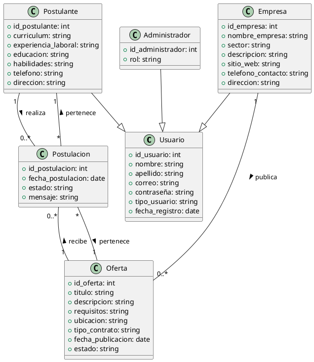

# Sistema de Bolsa de Empleo

Proyecto universitario para la gestión de ofertas de empleo y postulaciones.

## Estructura del Proyecto

```
Proyecto_Bolsa_de_Empleo/
├── frontend/           # Aplicación Ionic
└── backend/           # API Node.js/Express
```

## Requisitos Previos

- Node.js (v14+)
- Ionic CLI
- PostgreSQL
- Git

## Configuración Inicial

### Frontend (Ionic)
```bash
cd frontend
npm install
ionic serve
```

### Backend (Node.js)
```bash
cd backend
npm install
npm run dev
```

## Tecnologías Utilizadas

- Frontend: Ionic 7+ con Angular
- Backend: Node.js con Express
- Base de datos: PostgreSQL
- Autenticación: JWT

## Características Principales

- Registro y autenticación de usuarios
- Gestión de perfiles profesionales
- Publicación de vacantes
- Sistema de postulaciones
- Notificaciones en tiempo real 

## Entidades, Atributos y Relaciones - Sistema Bolsa de Empleo

### 1. Usuario
- id_usuario (PK)
- nombre
- apellido
- correo
- contraseña
- tipo_usuario (postulante/empresa/administrador)
- fecha_registro

### 2. Postulante (hereda de Usuario)
- id_postulante (PK, FK a Usuario)
- currículum
- experiencia_laboral
- educación
- habilidades
- teléfono
- dirección

### 3. Empresa (hereda de Usuario)
- id_empresa (PK, FK a Usuario)
- nombre_empresa
- sector
- descripción
- sitio_web
- teléfono_contacto
- dirección

### 4. Oferta
- id_oferta (PK)
- id_empresa (FK a Empresa)
- titulo
- descripcion
- requisitos
- ubicacion
- tipo_contrato
- fecha_publicacion
- estado (activa/inactiva)

### 5. Postulación
- id_postulacion (PK)
- id_oferta (FK a Oferta)
- id_postulante (FK a Postulante)
- fecha_postulacion
- estado (enviada/aceptada/rechazada)
- mensaje

### 6. Administrador (hereda de Usuario)
- id_administrador (PK, FK a Usuario)
- rol

### Relaciones principales
- Un Usuario puede ser Postulante, Empresa o Administrador (herencia).
- Una Empresa puede publicar muchas Ofertas (1 a N).
- Un Postulante puede realizar muchas Postulaciones (1 a N).
- Una Oferta puede recibir muchas Postulaciones (1 a N).
- Una Postulación pertenece a un Postulante y a una Oferta (N a 1 en ambos casos).
- Un Administrador puede gestionar usuarios, ofertas y postulaciones (relación de gestión, no reflejada como FK directa pero sí en lógica de negocio). 

## Diagrama de Clases (PlantUML)

Puedes visualizar este diagrama copiando el siguiente código en [PlantUML Online Server](https://www.plantuml.com/plantuml) o [PlantText](https://www.planttext.com/):



## Stack Tecnológico y Resumen de Implementación

### Lenguaje de Programación
- **JavaScript** (Node.js) para el backend
- (Próximamente) **TypeScript/JavaScript** con Angular para el frontend móvil (Ionic)

### Frameworks y Librerías
- **Node.js**: Entorno de ejecución para JavaScript en el backend
- **Express.js**: Framework para crear el servidor y las rutas HTTP
- **pg**: Cliente de PostgreSQL para Node.js
- **dotenv**: Manejo de variables de entorno
- **bcryptjs**: (A implementar) Para encriptar contraseñas
- **jsonwebtoken**: (A implementar) Para autenticación con JWT

### Base de Datos
- **PostgreSQL**: Motor de base de datos relacional
- Estructura y relaciones documentadas en este README y en el archivo `instalar_e_implementar_base_de_datos.txt`

### Estructura del Backend
- Modelos en `backend/src/models/` para cada entidad principal:
  - usuario.js
  - postulante.js
  - empresa.js
  - oferta.js
  - postulacion.js
  - administrador.js
- Cada modelo contiene funciones para crear y buscar registros en la base de datos.
- Conexión a la base de datos gestionada en `backend/src/config/database.js` usando variables de entorno definidas en `.env`.

### Estado Actual del Proyecto
- Base de datos creada y conectada exitosamente al backend
- Modelos implementados para todas las entidades principales
- Rutas base creadas (aún vacías, listas para implementar lógica de negocio)
- Script SQL y pasos de instalación documentados

### Próximos Pasos
- Implementar endpoints de autenticación (registro, login, JWT)
- Implementar CRUD para vacantes y postulaciones
- Validaciones y control de errores
- (Opcional) Documentación de la API con Swagger/OpenAPI

--- 